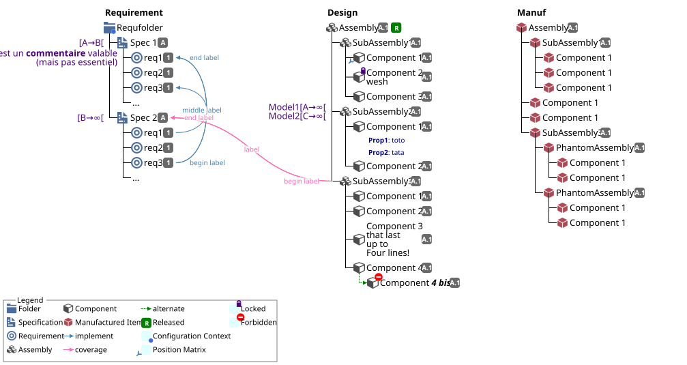

# Demo of bomarkdown capabilities
## Stock capabilities

<!--bomarkdown demo/Stock
${{
"legendcolumns":4
}}$

+ **Requirement**
+ (i:folder,Requfolder)(b:context)
 + (i:spec,Spec 1,A)(e:[A->B[)
  + (e:c'est un **commentaire** valable)(i:req,req1,1)(a:u1)
  + (i:req,req2,1)
  + (i:req,req3,1)(a:u3)
  + (i:...)
 + (i:spec,Spec 2,A)(a:spec1)(e:[B->#oo[)
  + (i:req,req1,1)(l:i:u3!middle label)
  + (i:req,req2,1)
  + (i:req,req3,1)(l:i:u1!>begin label,u1!<end label)
  + (i:...)
+newcolumn 100
+ **Design**
+ (i:assembly,Assembly,A.1)(s:R)
 + (i:assembly,SubAssembly1,A.1)(l:s:ma1!>begin,ma1!middle,ma1!<end)
  + (i:component,Component 1,A.1)(b:matrice)
  + (i:component,Component 2§wesh,A.1)(b:lock)
  + (i:component,Component 3,A.1)
 + (i:assembly,SubAssembly2,A.1)(e:Model1[A->#oo[§Model2[C->#oo[)
  + (i:component,Component 1,A.1)
  -+ **Prop1**: toto
  -+ **Prop2**: tata
  + (i:component,Component 2,A.1)
 + (i:assembly,SubAssembly3,A.1)(a:sa3)(l:c:spec1!>begin label,spec1!<end label,spec1!label)
  + (i:component,Component 1,A.1)
  + (i:component,Component 2,A.1)
  + (i:component,Component 3§that last§up to§Four lines!,A.1)
  + (i:component,Component 4,A.1)
  a+ (i:component,Component ***4 bis***,A.1)(b:noway)
+newcolumn 
+ **Manuf**
+ (i:mitem,Assembly,A.1)
 + (i:mitem,SubAssembly1,A.1)(a:ma1)
  + (i:mitem,Component 1)
  + (i:mitem,Component 1)
  + (i:mitem,Component 1)
 + (i:mitem,Component 1)
 + (i:mitem,Component 1)
 + (i:mitem,SubAssembly3,A.1)
  + (i:mitem,PhantomAssembly1,A.1)
   + (i:mitem,Component 1)
   + (i:mitem,Component 1)
  + (i:mitem,PhantomAssembly2,A.1)
   + (i:mitem,Component 1)
   + (i:mitem,Component 1)
-->

<!--bomarkdown simple
+ (i:assembly,Ceci est un long label,A.1)(s:D)
+ (i:assembly,Ceci est un long label§with two lines,A.1)(s:D)
+ no Item
+ no item§2 lines
-+ test property1
-+ test property2

-->
