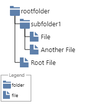
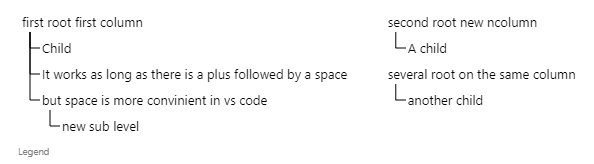
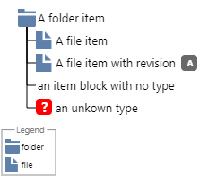
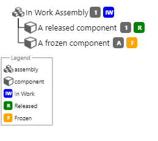
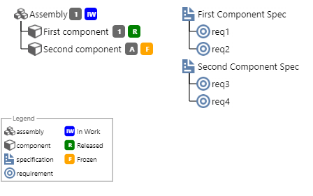
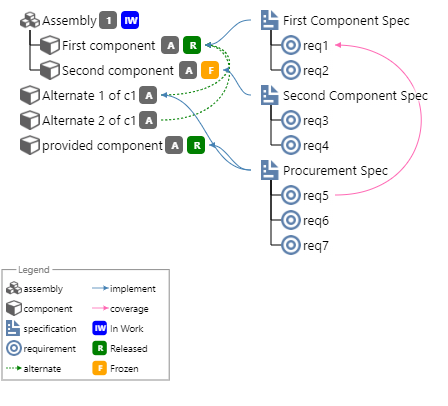
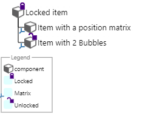
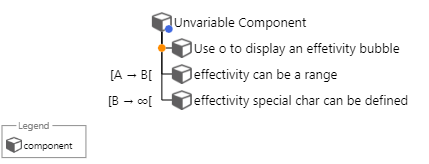
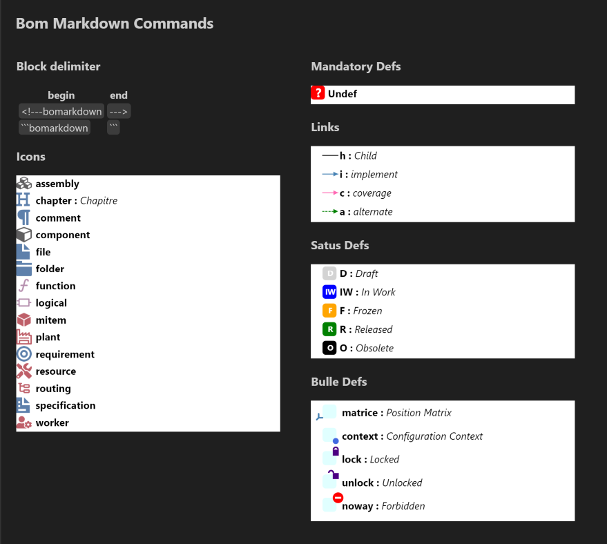

# BoMarkdown README

BoMarkdown is an extension that generetates a SVG representaion of a Bill of material (like a tree) from a textual description. It is inspired by other text to graph tools like plantuml or mermaid.js

````text
```bomarkdown:Images/FolderExample
+ (i:folder,rootfolder)
 + (i:folder, subfolder1)
  + (i:file, File)
  + (i:file, Another File)
 + (i:file, Root File)
```
````



## Features

### BOM Preview

launch it with the command palette or with a right click in a markdown file (*.md)

#### BOM syntax

##### Introduction

Each line of the bom is an item. Items can be linked either by a hiearchy link or a transversal (implement) link.

##### Heirachy

To create a BOM you must use the following notation:

````text
```bomarkdown:Images/BOMHierachy

+ first root first column
-+ Child
++ It works as long as there is a plus followed by a space
 + but space is more convinient in vs code
  + new sub level

line with no plus are ignored
to add a new column juste type
+newcolumn
+ second root new ncolumn
 +  A child
+ several root on the same column
 + another child

```
````



##### Type the items

an item can be typed by using a type block
````text
```bomarkdown:Images/typeitem
+ (i:folder,A folder item)
 + (i:file, A file item)
 + (i:file, A file item with revision,A)
 + (i:an item block with no type)
 + (i:foo,an unkown type)
```
````




to list all the availables types reffer to [BOM Commands](#bom-commands)

##### Define the status of the item

you can define the satus of an item by adding a status block

````text
```bomarkdown:Images/statusitem
+ (i:assembly,In Work Assembly,1)(s:IW)
 + (i:component, A released component,1)(s:R)
 + (i:component, A frozen component,A)(s:F)

```
````



##### Define several bom in a same graph

The bom can be distributed in several column and several root can be stacked in the same columm

````text
```bomarkdown:Images/multicolumn
+ (i:assembly,Assembly,1)(s:IW)
 + (i:component, First component,1)(s:R)
 + (i:component, Second component,A)(s:F)

+newcolumn
+ (i:specification,First Component Spec)
 + (i:requirement, req1)
 + (i:requirement, req2)
+ (i:specification,Second Component Spec)
 + (i:requirement, req3)
 + (i:requirement, req4)
```
````



##### Aliases and implement link

In addition to the hierachical link you can create transverse link to do so you should use a link block (a:)
the link block is in 2 parts (s:[alias])(l:i:[aliases of linked element separated by ,])
the link is drawn from the item to the ones in the (l:) block. you can have several (l:) block on an item to draw several link types

````text
```bomarkdown:Images/aliasesandlinks
{
  "verbose":true
}

+ (i:assembly,Assembly,1)(s:IW)
 + (i:component, First component,A)(s:R)(a:c1)
 + (i:component, Second component,A)(s:F)(a:c2)
+ (i:component,Alternate 1 of c1,A)(a:a1)(l:a:c1)
+ (i:component,Alternate 2 of c1,A)(a:a2)(l:a:c1)
+ (i:component,provided component,A)(s:R)(a:c3)

+newcolumn
+ (i:specification,First Component Spec)(a:s1)(l:i:c1)
 + (i:requirement, req1)(a:specreq1)
 + (i:requirement, req2)
+ (i:specification,Second Component Spec)(a:s2)(l:i:c2)
 + (i:requirement, req3)
 + (i:requirement, req4)(a:dum)
+ (i:specification,Procurement Spec)(a:s3)(l:i:c3,a1)
 + (i:requirement, req5)(a:procreq1)(l:c:specreq1,specreq2)
 + (i:requirement, req6)
 + (i:requirement, req7)
```
````




##### Bubbles

On top of the type icon you can add a bubble to define a special characteristic of the item
the Bubbles are define in a block (b:[bubble1],[bubble2],...[bubblen]) the order in the list define the drawing order with the last being drawn on the top.

````text
```bomarkdown:Images/Bubbles

+ (b:lock)(i:component, Locked item)
 + (b:matrice)(i:component, Item with a position matrix)
 + (b:matrice,unlock)(i:component, Item with 2 Bubbles)
```
````



##### Effectivity

Effectivity can be defined before links with an effectivity block (e:)

````text
```bomarkdown:Images/effectivity
+ (b:context)(i:component,Unvariable Component)
 + (e:o)(i:component,Use o to display an effetivity bubble)
 + (e:[A -> B[)(i:component,effectivity can be a range)
 + (e:[B -> #oo[)(i:component,effectivity special char can be defined)
 + (b:eff)(e:[C -> #oo[)(i:component,A trick to have bubble and text)
```

````



### BOM Export

launch it with the command palette or with a right click in a markdown file (*.md)

The export commands generates a svg file
You must have your textfile saved on your computer.
the program tries to detect code block delimited by start and end point. Start and en point can de defined in the settings
On the starting block you can define an image path

```code
<!---BoMardown:[path to the svg file]
[BOM code here]
--->
```

The path use forward "/" and the name is without extension
If no block or path is detected the program will create a svg file with the same path as the current editor file.
Ex launching the command on  "c:\myfolder\myfile.txt" will create or update the myfile.png in the myfolder folder.

### Insert SVG in markdown

launch it with the command palette or with a right click in a markdown file (*.md)

Like the export the command will generate or update a svg file from the current code block
It will also insert an image markdown element below the code block and refresh the markdown preview enhanced window.

### BOM Commands

launch it with the command palette or with a right click in a markdown file (*.md)

This commands displays all the types (even those added by the user) links and bubbles.
Names can be copy pasted in your markdown



### Addicon

The add icon command is only in the command palette.
The command will ask a folder to the user and import all the image file of the folder in the Usericons.json file.
During the import it will convert the image files (png or jpg) in base64 format in order to be abble to embed icons in the svg.
The name of the icon is the filename in lowercase and with no extension.
You can update the icon by performing a new import of the folder with modified image files.
You can also edit the UserIcons.json to remove unwanted types and a folder with the default icons is packaged with the exentsion.

## Requirements

No dependencies. Works well with [Markdown Preview enhanced](https:)(l:i:)(l:i:marketplace.visualstudio.com)(l:i:items?itemName=shd101wyy.markdown-preview-enhanced)

## Extension Settings

### Simple settings

bomarkdown.h : Default Item height
bomarkdown.gap : space between element on a line
bomarkdown.panh : Horizontal pan distance between items
bomarkdown.panv : Vertical pan distance between items
bomarkdown.legendscale : scale of the legend
bomarkdown.renderlegend : Specifies if a legend block is computed and added a the bottom of the svg

### Complex settings:

#### bomarkdown.Linksdefinition

This setting is used to define the links of the bom. Its a dictionnary of objects defined by 5 properties

```json
"[name of the link]":{
  "label":"[label of the link for the legend]",
  "arrow":"[SVG marker definition]",
  "Color": "[html color]",
  "thickness":[thinkess of the link],
  "dashpattern":"[svg dasharray]"
}
```

Beware to escape the " in the marker svg definition
The dasharray definition can be found [here](https://developer.mozilla.org/en-US/docs/Web/SVG/Attribute/stroke-dasharray)

#### bomarkdown.revision

It's a simple object with 2 properties with html color that defines the background and the font color of the revision block

```json
"bomarkdown.revision": {
        "font": "white",
        "background":"dimgrey"
    },


```
          
#### bomarkdown.codeblockdelimiter

it defines the possible begining and ending identifier of a code block.
the identifiers can't contain space, the begin and end propeties contains a string with the identifiers seperated by a string

```json
            "bomarkdown.codeblockdelimiter": {
              "begin":"<!---bomarkdown ```bomarkdown",
              "end":"---> ```"
            }
```

#### bomarkdown.bubbles

it's and object witch each key is a bubble, the value is a svg element with an id equal to the bubble key

```json
            "bomarkdown.bubbles":{
                "[keyname1]": "<g id=\"[keyname1]\">[SVG elements]</g>",
                "[keyname2]": "<image  id="[keyname2]" witdh="[max 10]" height="[max 10]" x="[top left corner x]" y="[top left corner y]" preserveAspectRatio="xMinYMid" xlink:href="[base 64 encoding of the image with the mime]"/>"
              } 
```

The bubble is positioned in regards of the top left corner of the type icon

#### bomarkdown.satus

it's and object witch each key is a status, the value is a svg element with an id equal to the status key

```json
            "bomarkdown.satus":{
              "[status]":"<g id=\"[status]\">\n<rect x=\"0\" y=\"1\" width=\"18\" height=\"18\" fill=\"lightgray\" rx=\"4\"/>\n<text font-family=\"system-ui\" dominant-baseline=\"middle\" text-anchor=\"middle\" font-weight=\"bold\" font-style=\"normal\" font-size=\"10\" x=\"10\" y=\"11\" fill=\"white\" >\nD\n</text>\n</g>",
            }
```

          
#### bomarkdown.MandatoryDefs

Object containing svg element mandatory for the rendition

- undef : is the element displayed when the type is unknown
- placeholder : element used in the commands for bubbles
- eff : element displayed on a link with the (e:o) block
- grad : gradient drawn behind each item label text block

#### bomarkdown.UTF8replacement":

Objet used to replace a string by an utf8 symbol in the effectivity. For instance #00 is redenred as &#x221E; or -> as &#x2192;

## Known Issues

None yet

## Release Notes

### 0.1.0

Initial release of BoMarkdown

### 0.2.0

Bug fix 
Support for bubbles and status in the legend

---
