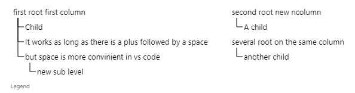
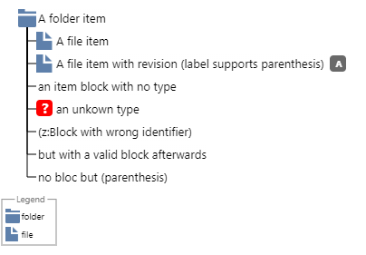
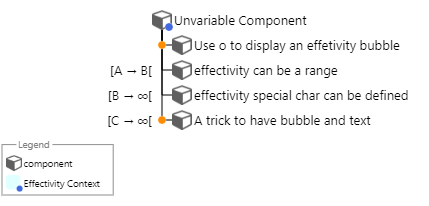

# BoMarkdown README

BoMarkdown is an extension that generetates a SVG representaion of a Bill of material (like a tree) from a textual description. It is inspired by other text to graph tools like plantuml or mermaid.js

````
```bomarkdown Images/FolderExample
+ (i:folder,rootfolder)
 + (i:folder, subfolder1)
  + (i:file, Fil>e)
  + (i:file, Another File)
 + (i:file, Root File)
```
````


## Features

### BOM Preview

launch it with the command palette (crtl + shift + p) or with a right click in a markdown file (*.md)

#### BOM syntax

##### Introduction

Each line of the bom is an item. Items can be linked either by a hiearchy link or a transversal(s) link(s).

##### Heirachy

To create a BOM you must use the following notation:

````text
```bomarkdown Images/BOMHierachy

+ first root first column
-+ Child
++ It works as long as there is a plus followed by a space
 + but space is more convinient in vs code
  + new sub level

line with no plus are ignored
to add a new column juste type
+newcolumn
+ second root new ncolumn
 +  A child
+ several root on the same column
 + another child

```
````


In order to be detected in the editor you should use code block delimiter either the regular fenced code block of markdown or a comment with a special keyword. 
with the fenced code block your code will be rendered in the markdown document, with the commment the code will not be displayed.
Right now the bomarkdown syntax is not supported in markdown as a workaround the bomarkdown code generates a svg and the svg can be integrated in the markdown document see [export](#bom-export) or [insertSVG](#insert-svg-in-markdown) for more information


**Example of a redenred code with its svg graph**
````text

```bomarkdown <Images folder>/<image name>
[bomarkdown code]

```

````

**Example of a not redenred code with its svg graph**
```
<!--bomarkdown <Images folder>/<image name>
[bomarkdown code]

-->

```


##### Type the items

an item can be typed by using a type block
````text
```bomarkdown Images/typeitem
+ (i:folder,A folder item) As long as there is a block text after blocks is ignored  
 + (i:file, A file item) so it can be use as a comment
 + (i:file, A file item with revision (label supports parenthesis),A)
 + (i:an item block with no type)
 + (i:foo,an unkown type)
 + (z:Block with wrong identifier)
 + (z:Block with wrong identifier)(i:but with a valid block afterwards)
 + no bloc but (parenthesis)

```
````



A snippet can be used to help [item block](#item-snippet) definition

The legend is automatically generated depending on a [global parameter](#legend)

it can be forced using a parameter definition

````text
```bomarkdown Images/typeitem-nolegend
${{
  "haslegend":false
}}$
+ (i:folder,A folder item) As long as there is a block text after blocks is ignored  
 + (i:file, A file item) so it can be use as a comment
 + (i:file, A file item with revision (label supports parenthesis),A)
 + (i:an item block with no type)
 + (i:foo,an unkown type)
 + (z:Block with wrong identifier)
 + (z:Block with wrong identifier)(i:but with a valid block afterwards)
 + no bloc but (parenthesis)

```
````


you can use markdown emphasis to highlight word in the label
````text
```bomarkdown Images/typeitem-emphasis
${{
  "haslegend":false 
}}$
+ (i:folder,A folder item)  
 + (i:file, ***Emphase all the label***) 
 + (i:file, A file item with revision (*Emphase just a part of it*))
 + (i:file,*it also can be **nested***)
  
```
````


````text
```bomarkdown Images/typeitem-emphasis-custom
${{
  "haslegend":false,
  "emphasis":
    [
                {
                "regex":"\\*\\*\\*(.*?)\\*\\*\\*",
                "expression":"***",
                "svgparam":"fill=\"green\"",
                "weight":"bold",
                "style": "italic"
              },{                
                "regex":"\\*\\*(.*?)\\*\\*",
                "expression":"**",
                "svgparam":"",
                "weight":"bold",
                "style": "normal"
              },{                
                "regex":"\\*(.*?)\\*",
                "expression":"*",
                "svgparam":"",
                "weight":"normal",
                "style": "italic"
              },{                
                "regex":"#(.*?)#",
                "expression":"#",
                "svgparam":"stroke=\"blue\" stroke-width=\"1\" fill=\"white\"",
                "weight":"normal",
                "style": "normal"
              }
            ]
  
}}$
+ (i:folder,A folder item)  
 + (i:file, ***Emphase all the label***) 
 + (i:file, A file item with revision (*Emphase just a part of it*))
 + (i:file,*it also can be **nested***)
  + (i:file,#use of custom marker#)

```
````


to list all the availables types reffer to [BOM Commands](#bom-commands)

to add new type reffer to the [addicon](#addicon) command

##### Define the status of the item

you can define the satus of an item by adding a status block

````text
```bomarkdown Images/statusitem
+ (i:assembly,In Work Assembly,1)(s:IW)
 + (i:component, A released component,1)(s:R)
 + (i:component, A frozen component,A)(s:F)

```
````


A snippet can be used to help [status block](#status-snippet) definition


Status rendition is customizable in the [settings](#bomarkdownsatus)

##### Define several bom in a same graph

The bom can be distributed in several column and several root can be stacked in the same columm. You also can increase the space with the previous column.

````text
```bomarkdown Images/multicolumn
+ (i:assembly,Assembly,1)(s:IW)
 + (i:component, First component,1)(s:R)
 + (i:component, Second component,A)(s:F)

+newcolumn
+ (i:specification,First Component Spec)
 + (i:requirement, req1)
 + (i:requirement, req2)
+ (i:specification,Second Component Spec)
 + (i:requirement, req3)
 + (i:requirement, req4)
 + (i:comment,Label,Revision)

you can define an additional gap between column 

+newcolumn 100
+(i:logical,Logical)
```
````


##### Aliases and implement link

In addition to the hierachical link you can create transverse link to do so you should use a link block (a:)
the link block is in 2 parts (s:[alias])(l:i:[aliases of linked element separated by ,])
the link is drawn from the item to the ones in the (l:) block. you can have several (l:) block on an item to draw several link types

````text
```bomarkdown Images/aliasesandlinks


+ (i:assembly,Assembly (avec parenthèse),1)(s:IW)
 + (i:component, First component,A)(s:R)(a:c1)
 + (i:component, Second component,A)(s:F)(a:c2)
+ (i:component,Alternate 1 of c1,A)(a:a1)(l:a:c1)
+ (i:component,Alternate 2 of c1,A)(a:a2)(l:a:c1)
+ (i:component,provided component,A)(s:R)(a:c3)
+ (i:component,Provided component 2,A)(s:IW)(a:c4)

+newcolumn
+ (i:specification,First Component Spec)(a:s1)(l:i:c1)
 + (i:requirement, req1)(a:specreq1)
 + (i:requirement, req2)(a:specreq2)
+ (i:specification,Second Component Spec)(a:s2)(l:i:c2)
 + (i:requirement, req3)
 + (i:requirement, req4)(a:dum)
+ (i:specification,Procurement Spec)(a:s3)(l:i:a2,a1)
 + (i:requirement, req5)(a:procreq1)(l:c:specreq1,specreq2)(l:i:c4)
 + (i:requirement, req6)
 + (i:requirement, req7)
```
````


A snippet can be used to help [link block](#link-snippet) definition
A snippet can be used to help [alias block](#alias-snippet) definition


links types and definition are customizable in the [settings](#bomarkdownlinksdefinition)

##### Bubbles

On top of the type icon you can add a bubble to define a special characteristic of the item
the Bubbles are define in a block (b:[bubble1],[bubble2],...[bubblen]) the order in the list define the drawing order with the last being drawn on the top.

````text
```bomarkdown Images/Bubbles

+ (b:lock)(i:component, Locked item)
 + (b:matrice)(i:component, Item with a position matrix)
 + (b:matrice,unlock)(i:component, Item with 2 Bubbles)
```
````


A snippet can be used to help [bubble block](#bubble-snippet) definition

Bullbes definitions are customizable in the [settings](#bomarkdownbubbles)

##### Effectivity

Effectivity can be defined before links with an effectivity block (e:)

````text
```bomarkdown Images/effectivity
+ (b:context)(i:component,Unvariable Component)
 + (e:o)(i:component,Use o to display an effetivity bubble)
 + (e:[A -> B[)(i:component,effectivity can be a range)
 + (e:[B -> #oo[)(i:component,effectivity special char can be defined)
 + (b:eff)(e:[C -> #oo[)(i:component,A trick to have bubble and text)
```

````

A snippet can be used to help [effectivity block](#effectivity-snippet) definition


special char replacement are define in the [settings](#bomarkdownutf8replacement)

### BOM Export

launch it with the command palette or with a right click in a markdown file (*.md)

The export commands generates a svg file
You must have your textfile saved on your computer.
the program tries to detect code block delimited by start and end point. Start and en point can de defined in the [settings](#bomarkdowncodeblockdelimiter-codeblockdelimiter)
On the starting block you can define an image path

```code
<!---bomarkdown [path to the svg file]
[BOM code here]
--->
```

The path use forward "/" and the name is without extension
If no block or path is detected the program will create a svg file with the same path as the current editor file.
Ex launching the command on  "c:\myfolder\myfile.txt" will create or update the myfile.png in the myfolder folder.

### Insert SVG in markdown

launch it with the command palette or with a right click in a markdown file (*.md)

Like the export the command will generate or update a svg file from the current code block
It will also insert an image markdown element below the code block and refresh the markdown preview enhanced window.


### BOM Commands {#bom-commands}

launch it with the command palette or with a right click in a markdown file (*.md)

This commands displays all the types (even those added by the user) links and bubbles.
Names can be copy pasted in your markdown


### Addicon

The add icon command is only in the command palette.

The command will ask a folder to the user and import all the image file of the folder in the Usericons.json file.
During the import it will convert the image files (png or jpg) in base64 format in order to be abble to embed icons in the svg.
The name of the icon is the filename in lowercase and with no extension.
You can update the icon by performing a new import of the folder with modified image files. The addicon command is based on the filename :if the filename exists in the json only b64 encoding is updated
At the end of the import an json file is created and added to the [IconJson](#bomarkdowniconjson) setting


<!--bomarkdown Images/addicon

${{
"haslegend":false
}}$
+ before import
+ (i:folder,Parent folder)
 + (i:folder,Image Folder)
  + (i:spec,Image1)
  + (i:spec,Image2)
  + (i:spec,Image3)
  + 
  + ...
+newcolumn

+ after import
+ (i:folder,Parent folder)
 + (i:folder,Image Folder)
  + (i:spec,Image1)
  + (i:spec,Image2)
  + (i:spec,Image3)
  + ...
+ (i:file,Image Folder_icons.json)
-->


You can also edit the UserIcons.json to remove unwanted types and a folder with the default icons is packaged with the exentsion.

After an icon update you can launch the bomarkdown.updatesnippets command to update the item type in the snippet

### Edit UserIcons.json
This command is only in the command palette.
It opens the selected json icon file for edition


you can add a label to a icon for the legend :

```json
[
  {
    "name": "assembly",
    "type": "png",
    "icon": "data:image/png;base64,iVBORw0KGgoAAAANSUhEU...ZMAAAAASUVORK5CYII="
  },
  {
    "name": "chapter",
    "label": "Chapitre",
    "type": "png",
    "icon": "data:image/png;base64,iVBORw0KGgoAAAANSUhEUgAAADAAAAAw...BJRU5ErkJggg=="
  }
]
```
When you are done don't forget to save the file


## Requirements

No dependencies. Works well with [Markdown Preview enhanced](https://marketplace.visualstudio.com/items?itemName=shd101wyy.markdown-preview-enhanced)

## Extension theme and color
The extension comme with textmate gramar rule to colorise the text of bommarkdow. You can add the followings code without comment in you usersetting.json (workbench.action.openSettingsJson). The name of the theme support joker char so by default the bomarkdown theme is applied  if the theme name incule Light or Dark in its name.
```json
    "editor.tokenColorCustomizations": {
      "[<Name of the theme>]": {
        "textMateRules": [
        {
          // definition for the effectivity by default same color as the function
          "scope":"effectivity.block.bomarkdown",
          "settings": {
            "foreground": "#DCDCAA",
            "fontStyle": "italic"
            
          }
        },{
          // definition for the bubble by default same color as the class
          "scope":"bubble.block.bomarkdown",
          "settings": {
            "foreground": "#4EC9B0"
          }
        },{
          "scope":"item.block.bomarkdown",
          "settings": {
             "fontStyle": "bold"
             
          }
        },{
          // definition for the link by default same color as the storage type (const function ...)
          "scope":"status.block.bomarkdown",
          "settings": {
            "foreground": "#569CD6"
          }
        },{
          // definition for the link by default same color as the keyword
          "scope":"link.block.bomarkdown",
          "settings": {
            "foreground": "#C586C0"
          }
        },{
          // definition for the link by default color is a darker keyword
          "scope":"alias.block.bomarkdown",
          "settings": {
            "foreground": "#a32399",
            "fontStyle": "bold"
          }
        }
      ]
      }
    }
```


## Extension Snippets

If settings are modified or type added snippets can be updated with the command : bomarkdown.updatesnippets

In order for the snippet to show automatically the default usersetting is  modified with : 
```json
    "[markdown]": {
   "editor.snippetSuggestions": "top", 
  "editor.quickSuggestions": {
    "other": true,
    "comments": false,
    "strings": true
    
    }},
    "[bomarkdown]": {
        "editor.quickSuggestions": {
          "other": true,
          "comments": false,
          "strings": true
          }},

```


### Codeblock snippet

code block snippet can be triggered with ''' for standard markdown code block

or <! for the commented codeblock

Note : those snippet are not automatic and the use of the crt+ space shortcut is recommended


### Item snippet
item snippet is triggered by (i:


### Alias snippet
Alias snippet is triggered by (a:

### Bubble snippet
Bubble snippet is triggered by (b:

### Effectivity snippet
Effectivity snippet is triggered by (e:


### Newbom snippet
newbom snippet is triggered by +new


### Link snippet
link snippet is triggered by (l:


### Status snippet
Status snippet is triggered by (s:


## Extension Settings

### Simple settings {#simplesetting}

bomarkdown.h : Default Item height
bomarkdown.gap : space between element on a line
bomarkdown.panh : Horizontal pan distance between items
bomarkdown.panv : Vertical pan distance between items
bomarkdown.legendscale : scale of the legend
bomarkdown.renderlegend : Specifies if a legend block is computed and added a the bottom of the svg

### Complex settings:

#### bomarkdown.iconjson
This settings list the path off all the icon json of the database. 
You can add or remove a path here.
In order for the addicon update feature to work you should name the json file \<icon folder name>_Icons.json and store it next to your icon folder.


#### bomarkdown.Linksdefinition

This setting is used to define the links of the bom. Its a dictionnary of objects defined by 5 properties

```json
"[name of the link]":{
  "label":"[label of the link for the legend]",
  "arrow":"[SVG marker definition]",
  "Color": "[html color]",
  "thickness":[thinkess of the link],
  "dashpattern":"[svg dasharray]"
}
```

Beware to escape the " in the marker svg definition
The dasharray definition can be found [here](https://developer.mozilla.org/en-US/docs/Web/SVG/Attribute/stroke-dasharray)

#### bomarkdown.revision

It's a simple object with 2 properties with html color that defines the background and the font color of the revision block

```json
"bomarkdown.revision": {
        "font": "white",
        "background":"dimgrey"
    },


```
          
#### bomarkdown.codeblockdelimiter

it defines the possible begining and ending identifier of a code block.
the identifiers can't contain space, the begin and end propeties contains a string with the identifiers seperated by a string

```json
            "bomarkdown.codeblockdelimiter": {
              "begin":"<!---bomarkdown ```bomarkdown",
              "end":"---> ```"
            }
```

#### bomarkdown.bubbles

it's and object witch each key is a bubble, the value is a svg element with an id equal to the bubble key

```json
            "bomarkdown.bubbles":{
                "[keyname1]": {
                  "svg":"<g id=\"[keyname1]\">[SVG elements]</g>",
                  "label":[label of the bubble]
                  },
                "[keyname2]": {
                  "svg":"<image  id="[keyname2]" witdh="[max 10]" height="[max 10]" x="[top left corner x]" y="[top left corner y]" preserveAspectRatio="xMinYMid" xlink:href="[base 64 encoding of the image with the mime]"/>",
                  "label":"label of the bubble"}
              } 
```

The bubble is positioned in regards of the top left corner of the type icon

#### bomarkdown.satus

it's and object witch each key is a status, the value is a svg element with an id equal to the status key

```json
            "bomarkdown.satus":{
              "[status]":{
                "svg":"<g id=\"[status]\">\n<rect x=\"0\" y=\"1\" width=\"18\" height=\"18\" fill=\"lightgray\" rx=\"4\"/>\n<text font-family=\"system-ui\" dominant-baseline=\"middle\" text-anchor=\"middle\" font-weight=\"bold\" font-style=\"normal\" font-size=\"10\" x=\"10\" y=\"11\" fill=\"white\" >\nD\n</text>\n</g>",
                "label":[label of the status]
                },
            }
```

          
#### bomarkdown.MandatoryDefs

Object containing svg element mandatory for the rendition

- undef : is the element displayed when the type is unknown
- placeholder : element used in the commands for bubbles
- eff : element displayed on a link with the (e:o) block
- grad : gradient drawn behind each item label text block

#### bomarkdown.UTF8replacement

Objet used to replace a string by an utf8 symbol in the effectivity. For instance #00 is redenred as &#x221E; or -> as &#x2192;

## Known Issues

None yet

## Release Notes

### 0.0.1

Initial release of BoMarkdown

### 0.1.0

first stable release in the markeplace
Bug fix 
Support for bubbles and status in the legend (setting datamodel modification)
Change in the parsing text after the last block is ignored and considered as comment

### 0.1.1

- Edit Json
- Readme update
- Add the ability to increase the gap between columm

### 0.2.0
  - emphasis support
  - snippets
  - bugfix

---
