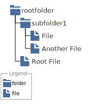
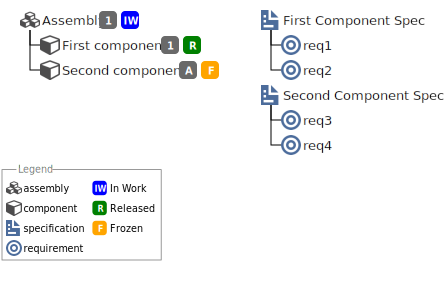

# bomarkdown README

BomMarkdown is an extension that generetates a SVG representaion of a Bill of material (like a tree) from a textual description. It is inspired by other text to graph tools like plantuml or mermaid.js

```BoMMarkdown:Images/FolderExample
+ (i:folder,rootfolder)
 + (i:folder, subfolder1)
  + (i:file, File)
  + (i:file, Another File)
 + (i:file, Root File)
```



## Features

### BOM Preview

#### BOM syntax

##### Introduction

Each line of the bom is an item. Items can be linked either by a hiearchy link or a transversal (implement) link.

##### Heirachy

To create a BOM you must use the following notation:

```BoMMarkdown:BOMHierachy

+ first root first column
-+ Child
++ It works as long as there is a plus followed by a space
 + but space is more convinient in vs code
  + new sub level

linewith no + are ignored
to add a new column juste type
+newcolumn
+ second root new ncolumn
 +  A child
+ several root on the same column
 + another child

```


##### Type the items
an item can be typed by using a type block

```BoMMarkdown:Images/typeitem
+ (i:folder,A folder item)
 + (i:file, A file item)
 + (i:file, A file item with revision,A)
 + (i:an item block with no type)
 + (i:foo,an unkown type)
```


to list all the availables types reffer to [BOM Commands](#bom-commands)

##### Define the status of the item

you can define the satus of an item by adding a status block 

```BoMMarkdown:Images/statusitem
+ (i:assembly,In Work Assembly,1)(s:IW)
 + (i:component, A released component,1)(s:R)
 + (i:component, A frozen component,A)(s:F)

```


##### Define several bom in a same graph

The bom can be distributed in several column and several root can be stacked in the same columm

```BoMMarkdown:Images/multicolumn
+ (i:assembly,Assembly,1)(s:IW)
 + (i:component, First component,1)(s:R)
 + (i:component, Second component,A)(s:F)

+newcolumn
+ (i:specification,First Component Spec)
 + (i:requirement, req1)
 + (i:requirement, req2)
+ (i:specification,Second Component Spec)
 + (i:requirement, req3)
 + (i:requirement, req4)
```




##### Aliases and implement link


### BOM Export

### BOM Commands

### Addicon

## Requirements

No dependencies

## Extension Settings

Include if your extension adds any VS Code settings through the `contributes.configuration` extension point.

For example:

This extension contributes the following settings:

* `myExtension.enable`: Enable/disable this extension.
* `myExtension.thing`: Set to `blah` to do something.

## Known Issues

None yet

## Release Notes

### 0.1.0

Initial release of BomMarkdown

---
