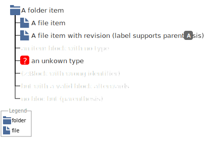
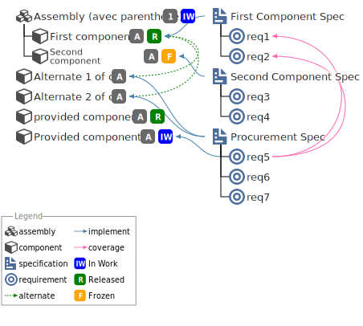
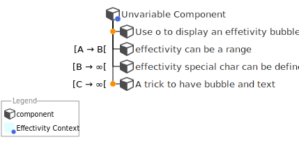

# bomarkdown README

BomMarkdown is an extension that generetates a SVG representaion of a Bill of material (like a tree) from a textual description. It is inspired by other text to graph tools like plantuml or mermaid.js

```BoMMarkdown:Images/FolderExample
+ (i:folder,rootfolder)
 + (i:folder, subfolder1)
  + (i:file, File)
  + (i:file, Another File)
 + (i:file, Root File)
```


## Features

### BOM Preview

#### BOM syntax

##### Introduction

Each line of the bom is an item. Items can be linked either by a hiearchy link or a transversal (implement) link.

##### Heirachy

To create a BOM you must use the following notation:

```BoMMarkdown:BOMHierachy

+ first root first column
-+ Child
++ It works as long as there is a plus followed by a space
 + but space is more convinient in vs code
  + new sub level

line with no plus are ignored
to add a new column juste type
+newcolumn
+ second root new ncolumn
 +  A child
+ several root on the same column
 + another child

```

(l:i:Images/bomheirachy.png "BomMarkdown Hierachy")

##### Type the items

an item can be typed by using a type block

```BoMMarkdown:Images/typeitem
+ (i:folder,A folder item)
 + (i:file, A file item)
 + (i:file, A file item with revision,A)
 + (i:an item block with no type)
 + (i:foo,an unkown type)
```



to list all the availables types reffer to [BOM Commands](#bom-commands)

##### Define the status of the item

you can define the satus of an item by adding a status block 

```BoMMarkdown:Images/statusitem
+ (i:assembly,In Work Assembly,1)(s:IW)
 + (i:component, A released component,1)(s:R)
 + (i:component, A frozen component,A)(s:F)

```


##### Define several bom in a same graph

The bom can be distributed in several column and several root can be stacked in the same columm

```BoMMarkdown:Images/multicolumn
+ (i:assembly,Assembly,1)(s:IW)
 + (i:component, First component,1)(s:R)
 + (i:component, Second component,A)(s:F)

+newcolumn
+ (i:specification,First Component Spec)
 + (i:requirement, req1)
 + (i:requirement, req2)
+ (i:specification,Second Component Spec)
 + (i:requirement, req3)
 + (i:requirement, req4)
```


##### Aliases and implement link

In addition to the hierachical link you can create transverse link to do so you should use a link block (a:)
the link block is in 2 parts (s:[alias])(l:i:[aliases of linked element separated by ,])
the link is drawn from the item to the ones in the (l:) block. you can have several (l:) block on an item to draw several link types

```BoMMarkdown:Images/aliasesandlinks

+ (i:assembly,Assembly,1)(s:IW)
 + (i:component, First component,A)(s:R)(a:c1)
 + (i:component, Second component,A)(s:F)(a:c2)
+ (i:component,Alternate 1 of c1,A)(a:a1)(l:a:c1)
+ (i:component,Alternate 2 of c1,A)(a:a2)(l:a:c1)
+ (i:component,provided component,A)(s:R)(a:c3)


+newcolumn
+ (i:specification,First Component Spec)(a:s1)(l:i:c1)
 + (i:requirement, req1)(a:specreq1)
 + (i:requirement, req2)
+ (i:specification,Second Component Spec)(a:s2)(l:i:c2)
 + (i:requirement, req3)
 + (i:requirement, req4)(a:dum)
+ (i:specification,Procurement Spec)(a:s3)(l:i:c3,a1)
 + (i:requirement, req5)(a:procreq1)(l:c:specreq1,specreq2)
 + (i:requirement, req6)
 + (i:requirement, req7)


```



##### Bubbles

On top of the type icon you can add a bubble to define a special characteristic of the item
the Bubbles are define in a block (b:[bubble1],[bubble2],...[bubblen]) the order in the list define the drawing order with the last being drawn on the top.

```BoMMarkdown:Images/Bubbles
+ (b:lock)(i:component, Locked item)
 + (b:matrice)(i:component, Item with a position matrix)
 + (b:matrice,unlock)(i:component, Item with 2 Bubbles)
```


##### Effectivity

Effectivity can be defined before links with an effectivity block (e:)

```BoMMarkdown:Images/effectivity
+ (b:context)(i:component,Unvariable Component)
 + (e:o)(i:component,Use o to display an effetivity bubble)
 + (e:[A -> B[)(i:component,effectivity can be a range)
 + (e:[B -> #oo[)(i:component,effectivity special char can be defined)
```



### BOM Export

The export commands generetates a svg file

### BOM Commands

This commands displays all the types (even those added by the user) links and bubbles.
Names can be copy pasted in your markdown


### Addicon

## Requirements

No dependencies. Works well with [Markdown Preview enhanced](https:)(l:i:)(l:i:marketplace.visualstudio.com)(l:i:items?itemName=shd101wyy.markdown-preview-enhanced)

## Extension Settings

Include if your extension adds any VS Code settings through the `contributes.configuration` extension point.

For example:

This extension contributes the following settings:

* `myExtension.enable`: Enable)(l:i:disable this extension.
* `myExtension.thing`: Set to `blah` to do something.

## Known Issues

None yet

## Release Notes

### 0.1.0

Initial release of BomMarkdown

---
